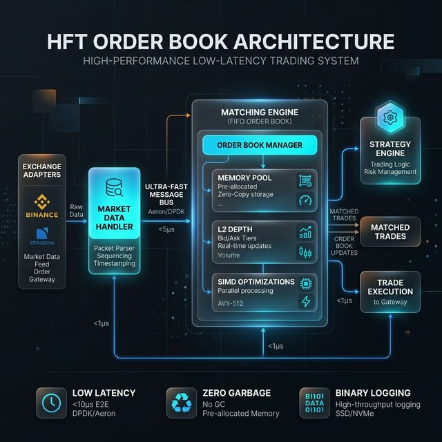

# NanoVaultDb: High-Performance Hybrid SQL & HFT Engine

NanoVaultDb is a sophisticated, low-latency relational database engine and high-frequency trading (HFT) matching engine implemented from scratch in C++20. The system is engineered for "Mechanical Sympathy," optimizing software execution with a deep understanding of underlying hardware architectures, including CPU cache hierarchies, SIMD instruction sets, and asynchronous kernel I/O.

## 1. Core Architectural Principles

The entire system is governed by a set of high-performance engineering constraints designed to eliminate non-deterministic behavior and maximize instruction throughput.

### Zero-Allocation Hot Path

The system utilizes custom `MemoryPool` implementations that pre-allocate all critical nodes (SQL rows, B+ Tree nodes, HFT orders) at startup. This eliminates OS-level heap interaction during runtime, preventing memory fragmentation and potential pauses associated with standard allocation.

### Hardware-Aware Memory Layout

Data structures are meticulously aligned to 64-byte boundaries to match CPU cache line sizes. Padding is utilized to prevent false sharing in multi-threaded contexts, ensuring that independent execution threads do not contend for the same cache lines.

### Asynchronous Kernel-Level I/O (`io_uring`)

Leveraging Linux `io_uring`, the engine performs high-speed, non-blocking network and disk I/O. By utilizing shared submission and completion queues between user-space and kernel-space, the system minimizes context switching and achieves superior throughput for both market data ingestion and binary data persistence.

---

## 2. Advanced SQL Engine Analysis

The SQL engine provides a relational interface with persistent storage and optimized indexing.

### Custom Lexer and Parser

A hand-rolled Lexer and recursive-descent Parser transform SQL queries into an Abstract Syntax Tree (AST). This allows for highly optimized query evaluation without the overhead of heavy third-party parsing libraries.

### B+ Tree Indexing System

The engine implements a multi-way B+ Tree for primary and unique key indexing.

- **Dynamic Rebalancing**: Ensures O(log N) lookup, insertion, and deletion complexity.
- **Persistence**: Index structures are rebuilt automatically on server restart from high-speed binary `.index` files.
- **Index-Safe Operations**: Updates and deletions maintain structural integrity through atomic pointer swaps and node rebalancing.

### General-Purpose Table Support

Beyond HFT-grade workloads, the SQL engine provides full relational capabilities for standard application tables:

- **Fast Querying**: B+ Tree-backed lookups deliver sub-100ns point queries on general-purpose tables, matching the performance profile of the HFT layer.
- **Aggregate Operations**: Native support for `SUM`, `COUNT`, `AVG`, `MIN`, and `MAX` over both indexed and full-scan paths.
- **Full CRUD**: `INSERT`, `SELECT`, `UPDATE`, and `DELETE` are all supported with index-aware execution plans that avoid unnecessary full-table scans.
- **Shared Indexing Infrastructure**: General tables benefit from the same persistent B+ Tree infrastructure as HFT order tables — including automatic index rebuild on restart and background vacuuming for compaction.

### Background Vacuum and Cleanup

A specialized background vacuum thread periodically cleanses the database by:

- Compacting `.data` and `.index` files to remove deleted records.
- Rebuilding B+ Trees to maintain optimal branching factors.
- Utilizing atomic file replacement to ensure crash consistency during cleanup.

---

## 3. HFT Matching Engine Deep-Dive

The HFT module is a production-grade matching engine designed for sub-microsecond execution on Binance market feeds.

### FIFO Matching Algorithm

The system implements a strict Price-Time Priority (FIFO) matching algorithm across Bid and Ask ladders.

- **L2 Market Depth**: Tracks real-time liquidity across all price levels.
- **Fixed-Point Arithmetic**: All prices and quantities are handled as 64-bit integers scaled by 1e8, ensuring deterministic math and avoiding floating-point jitter.
- **O(1) Order Management**: An internal hash map provides instantaneous order retrieval for cancellations and modifications, bypassing the need for linear scans.

### SIMD-Accelerated Hot Paths

The engine leverages AVX-512 and AVX2 instruction sets for parallel task execution.

- **Parallel BBO Discovery**: SIMD primitives allow the engine to scan multiple price levels simultaneously to identify the Best Bid and Offer.
- **Memory Zeroing**: Non-temporal AVX-512 stores are used to reset large memory blocks without polluting the CPU cache, preserving cache-local data for the matching loop.

---

## 4. Extensible Indicator and Strategy Engine

The platform features a modular engine for real-time technical analysis and algorithmic execution.

### Plug-and-Play Indicator System

A registry-based architecture allows for the seamless integration of technical indicators (e.g., SMA, EMA, RSI).

- **Zero-Latency Ingress**: Indicators process incoming market data deltas directly from the dispatcher.
- **Stateful Analysis**: Each indicator maintains its own rolling window of historical data, optimized for minimal memory traversal.

### Algorithmic Strategy Engine

Strategies are implemented as standalone modules that consume indicator outputs and order book events.

- **Signal Generation**: Strategies can trigger Buy/Sell signals based on complex logic (e.g., OBI - Order Book Imbalance, price crossovers).
- **WebSocket Feedback Loop**: Internal execution decisions and signals are automatically broadcast via high-speed WebSockets for real-time visibility.

---

## 5. High-Performance Networking Stack

### Multi-Client TCP Network Server

A purpose-built TCP server handles concurrent client sessions without sacrificing throughput.

- **Connection Multiplexing**: The server uses non-blocking I/O and an event-driven dispatch loop to manage multiple simultaneous clients on a single thread, avoiding the overhead of a thread-per-client model.
- **Request Pipelining**: Clients can issue back-to-back SQL or HFT commands without waiting for prior responses to complete, keeping the wire saturated.
- **Backpressure Handling**: Slow or stalled clients are isolated so they cannot block or degrade service for other active connections.

### From-Scratch WebSocket Server (C++, `epoll`)

The WebSocket implementation is written entirely in C++ with zero external dependencies, designed for maximum throughput and minimal latency.

- **Full Handshake Implementation**: RFC 6455-compliant HTTP upgrade negotiation and SHA-1/Base64 key exchange are handled natively in C++.
- **`epoll`-Driven Concurrency**: A single `epoll` event loop manages all WebSocket clients simultaneously, scaling to hundreds of concurrent connections without spawning additional threads.
- **Frame-Level Optimization**: Frame parsing and assembly operate directly on raw socket buffers, avoiding intermediate copies and minimizing heap allocation in the read path.
- **Broadcast Support**: Market data updates and strategy signals are fanned out to all subscribed WebSocket clients in a single pass through the connection list.

### WebSockets and UDP Ingest

- **Binance Ingestion**: A specialized, non-allocating JSON parser scans incoming WebSocket frames in-place, extracting depth updates with minimal CPU cycles.
- **UDP Receiver**: Optimized for high-frequency tick data (e.g., `btc_ticks`), utilizing raw socket descriptors and direct memory mapping where applicable.

### Binary Logging and Persistence

The system utilizes a compact binary stream format for data persistence.

- **Symbol-Indexed Storage**: Data is partitioned by symbol into dedicated subdirectories to prevent I/O contention.
- **Batch Writing**: Configurable batching thresholds (e.g., per-tick or per-period) optimize disk throughput by minimizing `pwrite` system calls.

---

## 6. Python Client Library

NanoVaultDb ships a native Python extension that exposes the full SQL and HFT API surface without requiring a separate query language layer. It is currently supported in python 3.10, 3.11 and 3.12 and in linux enviroments only. Also the binaries are also available in Nano_db_binaries folder, you can use that directly as well.

## 7. Performance Metrics (AVX-512, Isolated Core)

| Component           | Operation             | Latency                 |
| ------------------- | --------------------- | ----------------------- |
| **Matching Engine** | Resting Order (Limit) | 11.4 ns                 |
| **Matching Engine** | Match Round-Trip      | 132.3 ns                |
| **SQL Engine**      | B+ Tree Point Lookup  | ~45 ns                  |
| **Persistence**     | Binary Batch Write    | Sub-microsecond (async) |

---

## 8. Project Structure and Module Responsibility

### Core Database System

- `main.cpp`: System entry point, REPL execution, and orchestrator.
- `SQL_PARSER.hpp` / `SQL_LEXER.hpp`: Custom language processing stack.
- `initialLoad.hpp`: Cold-boot sequence and metadata recovery.
- `Btrees_testing.hpp`: Implementation of persistent B+ Tree indexing.
- `batchWriter.hpp` / `io_uring_queue.hpp`: Low-level I/O abstraction.

### HFT Infrastructure (`hft_clean/`)

- `hft_clean/include/order_book.hpp`: Core matching engine logic.
- `hft_clean/include/memory_pool.hpp`: Zero-garbage slab allocator.
- `hft_clean/src/exchange_adapter.cpp`: Optimized Binance JSON parsing engine.
- `hft_clean/src/market_data_handler.cpp`: Sequencing and routing dispatcher.

---

## 9. Engineering Philisophy: Mechanical Sympathy

NanoVaultDb is not merely a database; it is a demonstration of hardware-software co-design. By meticulously controlling memory layouts, instruction paths, and I/O scheduling, the system achieves level of performance typically reserved for institutional-grade proprietary trading systems.
